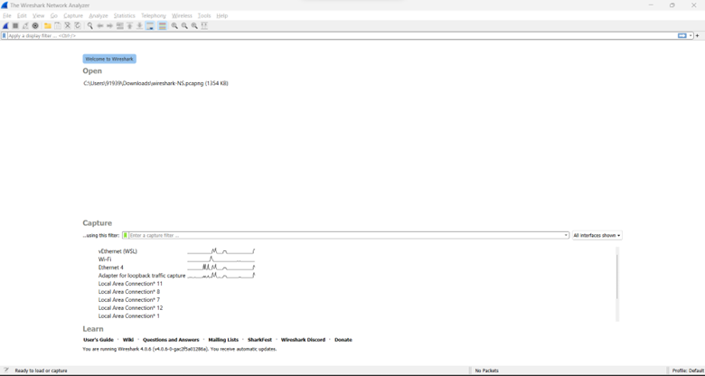
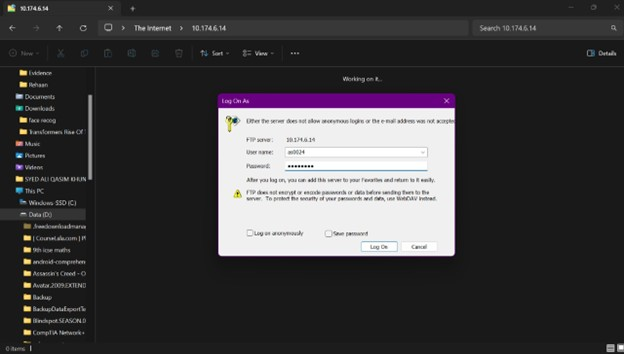

# Site-to-Site-VPN-Tunneling

## Lab 1 - Network Analysis

### Description

In this lab, we analyzed network traffic using the FTP protocol. FTP is considered insecure because it transmits data, including usernames and passwords, in plain text without encryption.

The objective of this lab was to demonstrate how credentials can be captured by monitoring network traffic and to understand the security risks associated with using FTP.

### Procedure

1. Install and launch Wireshark on the local machine.
2. Start packet capture in Wireshark.
3. Connect and log in to the FTP server.
4. Stop the packet capture after a successful login.
5. Locate the FTP login packets in Wireshark.
6. Analyze the captured packets to identify transmitted credentials.

### Observations

* Wireshark successfully captured network traffic.
* FTP credentials were transmitted in clear text.
* The username and password were visible in the packet details.
* This demonstrates why FTP is considered insecure and should be replaced with secure alternatives such as SFTP or FTPS.

## Screenshots


### Fig 1-1: installed wireshark and click on WiFi 


### Fig 1-2: Logging into the FTP server 
---

## Lab 2 - IPsec Tunneling

### Description

In this lab, an IPsec VPN tunnel was established between two sites:

* Toronto
* British Columbia

A Palo Alto Next-Generation Firewall (NGFW) was used to configure the VPN tunnel and secure communication between the two locations.

### Procedure

1. Configure the Palo Alto NGFW at both sites.
2. Create a Virtual Router to support VPN routing.
3. Configure the IKE Crypto Profile.
4. Configure the IPsec Crypto Profile.
5. Create and configure the IKE Gateway.
6. Configure the IPsec Tunnel.
7. Create security policies to allow traffic through the tunnel.
8. Verify connectivity by pinging hosts between the two sites.
9. Initiate IKE Phase 1 and Phase 2 using PuTTY commands.
10. Verify tunnel status and traffic flow.

### Observations

* IKEv2 was used for VPN negotiation.
* Authentication was configured using a pre-shared key: `Secret55`.
* Security policies were configured to allow traffic through the tunnel.
* Connectivity was verified successfully using ping tests.
* IKE Phase 1 and Phase 2 were established successfully.

Use the following command to view VPN traffic flow:

```bash
show vpn flow
```

* VPN traffic was visible and successfully encrypted.
* The tunnel status displayed a green indicator, confirming a successful VPN connection.

---

## Lab 3 - RSA Authentication

### Description

In this lab, RSA public-key authentication was configured between a Windows Server 2016 machine and a Rocky Linux 9.1 machine.

The objective was to establish passwordless SSH authentication using RSA key pairs.

### Environment

* Windows Server 2016
* Rocky Linux 9.1
* PuTTY
* PuTTYgen
* Pageant

### Procedure

1. Deploy Windows Server 2016 in vSphere.
2. Configure the IP address on the Windows Server.
3. Deploy Rocky Linux 9.1 in vSphere.
4. Configure the IP address on the Linux machine.
5. Verify network connectivity between both systems using ping.
6. Download and extract the PuTTY tools on Windows.
7. Launch PuTTYgen.
8. Generate an RSA key pair.
9. Copy the generated public key.

### Linux Configuration

Create the `.ssh` directory:

```bash
mkdir ~/.ssh
```

Set the appropriate permissions:

```bash
chmod 700 ~/.ssh
```

Create the `authorized_keys` file and paste the public key generated by PuTTYgen into it.

### Windows Configuration

1. Save the private key generated by PuTTYgen.
2. Protect the private key with the passphrase:

```text
Secret55
```

3. Launch `Pageant.exe`.
4. Load the private key into Pageant.
5. Connect to the Linux server using PuTTY.

### Observations

* The RSA key pair was generated successfully.
* The public key was stored in the `authorized_keys` file.
* The private key was securely stored and protected with a passphrase.
* Pageant successfully managed the private key.
* SSH authentication was completed using RSA keys instead of a password.
* Passwordless login was successfully achieved after configuration.

---

## Conclusion

These labs provided hands-on experience with:

* Network traffic analysis using Wireshark
* Security vulnerabilities associated with FTP
* IPsec VPN tunnel configuration using Palo Alto firewalls
* IKE and IPsec negotiation processes
* RSA key generation and SSH authentication
* Secure remote access using public-key cryptography

The exercises reinforced important concepts in network security, secure communications, and authentication mechanisms.
